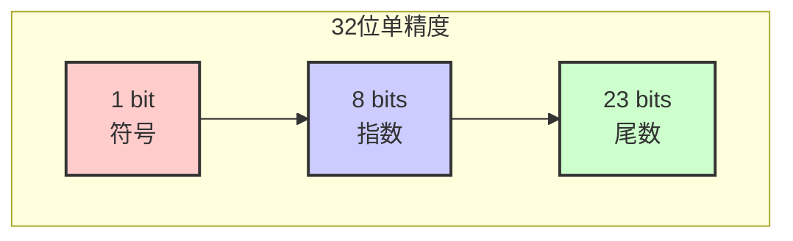
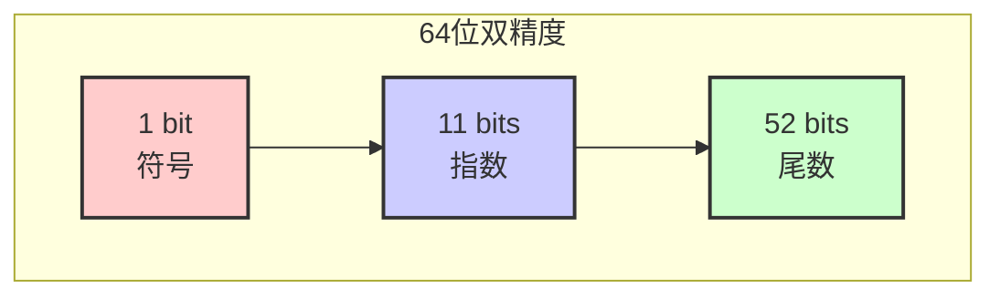
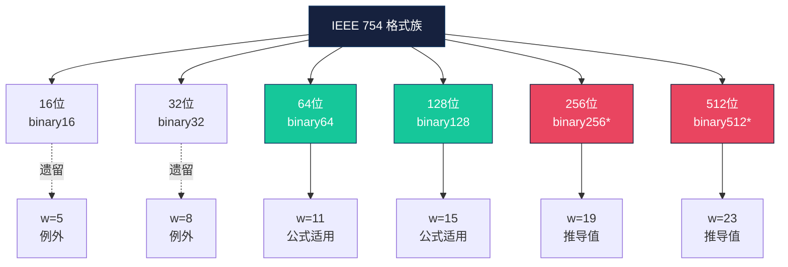

# IEEE 754：浮点数标准

> 关于计算机如何表示实数的入门指南。  
> 作者：Jiayao Hu

[English Version](<IEEE 754.md>) | [中文版本](<IEEE 754 Chinese Simplified.md>) 

## 1. 背景与定义

### 1.1 什么是 IEEE 754？

**IEEE 754** 是浮点运算的国际技术标准。它首次发布于 **1985 年**，后于 **2008 年**和 **2019 年**进行了修订，定义了：

- 实数在二进制中的表示方式 🔢
- 算术运算的行为规范 ➕➖✖️➗
- 无穷大和错误等特殊情况的处理方法 ⚠️

在 IEEE 754 之前，每家计算机制造商都使用自己的格式，这意味着同一程序在不同机器上可能产生**不同的结果**。IEEE 754 通过为二进制中的小数创建一种通用语言，解决了这一问题。

### 1.2 为什么叫“浮点”？

与**定点**数（小数点位置固定）不同，浮点数允许小数点“浮动”——通过**指数**向左或向右移动。这使得我们能用同一种格式表示**非常大**和**非常小**的数字。

可以类比科学记数法：

$$
6.022 \times 10^{23} \quad \leftarrow \text{小数点根据指数“浮动”}
$$

---

## 2. IEEE 754 标准

### 2.1 基本格式

IEEE 754 定义了多种格式，最常见的有：

| 格式 | 总位数 | 指数位 | 尾数位 | 精度（十进制有效位数） | 偏置 |
|--------|-----------|---------------|------------------|-----------|------|
| **binary16**（半精度） | 16 | 5 | 10 | ~3.3 位 | 15 |
| **binary32**（单精度） | 32 | 8 | 23 | ~7.2 位 | 127 |
| **binary64**（双精度） | 64 | 11 | 52 | ~15.9 位 | 1023 |
| **binary128**（四倍精度） | 128 | 15 | 112 | ~34.0 位 | 16383 |

> 💡 **binary64**（双精度）是大多数现代语言（如 Python、JavaScript 和 C++ 的 `double`）中的默认类型。

### 2.2 浮点数的结构

每个 IEEE 754 数都由三部分组成：

```
┌──────────┬──────────────────┬────────────────────────────────────────────┐
│  符号位  │     指数位       │               尾数位                    │
│  (1 bit)│    (w bits)     │              (t bits)                  │
└──────────┴──────────────────┴────────────────────────────────────────────┘
```

| 部分 | 作用 | 图标 |
|------|------|-------|
| **符号位** | `0` 表示正数，`1` 表示负数 | ➕➖ |
| **指数位** | 存储 2 的幂次（带偏置） | 📏 |
| **尾数位**（有效数） | 存储精度数字 | 🎯 |

实际值按以下公式计算：

$$
\text{值} = (-1)^{\text{符号}} \times {(1.\text{尾数})}_2 \times 2^{\text{指数} - \text{偏置}} 
$$

> 🔑 **关键点**：规格化数始终在尾数前隐含一个前导 `1`，这称为**隐藏位**技巧——相当于免费获得了一位额外精度！

### 2.3 位布局图（binary32 和 binary64）






### 2.4 特殊值

并非所有位模式都表示规格化数，指数域保留了一些特殊模式：

| 指数域 | 尾数 | 含义 | 示例 |
|----------------|-------------|---------|---------|
| 全零（`000...`） | 零 | **±0** | `+0.0`、`−0.0` |
| 全零（`000...`） | 非零 | **次规格化数** | 极小的数 |
| 全一（`111...`） | 零 | **±无穷大** | `1.0 / 0.0` |
| 全一（`111...`） | 非零 | **NaN（非数）** | `0.0 / 0.0` |

> 🧠 **次规格化数**会舍弃隐含的前导 `1`，改用 `0`。这避免了最小规格化数与零之间出现巨大空隙。

---

## 3. 示例：十进制 ⟷ IEEE 754

### 3.1 示例1：十进制 → IEEE 754 binary32（精确情况）

将 **9.625** 转换为 IEEE 754 单精度（binary32）。

#### 步骤1：转换为二进制
$$
9.625_{10} = 1001.101_2 = 1.001101_2 \times 2^3 \quad \leftarrow \text{规格化形式}
$$

#### 步骤2：提取各部分

| 成分 | 值 |
|-----------|-------|
| 符号 | `0`（正数） |
| 指数 | `3` |
| 尾数 | `001101`（前导 1 之后的部分） |

#### 步骤3：应用偏置

对于 binary32，偏置 = **127**。

$$
\text{存储的指数} = 3 + 127 = 130 = 10000010_2
$$

#### 步骤4：将尾数填充至 23 位
$$
\text{分数部分： } \underbrace{001101}_{6 \text{ 位}} \; \underbrace{00000000000000000}_{17 \text{ 个零}}
$$
#### 步骤5：组装
| 符号  | 指数  | 尾数 |
|--|--|--|
|  `0`   |  `10000010`   | `00110100000000000000000` |


**最终 32 位结果：**

`
0100 0001 0001 1010 0000 0000 0000 0000
`

**十六进制：** `0x411A0000` ✅

---

### 3.2 示例2：十进制 → IEEE 754 binary32（循环情况）

现在来看 **0.1** —— 它在二进制中无限循环。

#### 步骤1：转换为二进制
$$
0.1_{10} = 0.0001100110011..._2 \;（无限循环！）= (1.100110011...)_2 \times 2^{-4}
$$

#### 步骤2：舍入到 23 位

由于只有 23 位分数位，我们必须对无限序列进行**舍入**：

```
真实分数：    10011001100110011001100 110011...（循环）
存储（23位）： 10011001100110011001101
                              ↑
                        此处向上舍入
```

#### 步骤3：组装

- 符号：`0`
- 指数：`-4 + 127 = 123 = 01111011₂`
- 分数：`10011001100110011001101`

**结果：** `0x3DCCCCCD`

> ⚠️ **重要：** `0.1` **无法精确存储**。实际存储的值约为 `0.100000001490116119384765625`。这就是为什么在大多数编程语言中 `0.1 + 0.2 ≠ 0.3`！

---

### 3.3 示例3：IEEE 754 binary32 → 十进制

解码以下 binary32 数：

```
1100 0001 0110 1100 0000 0000 0000 0000
```

#### 步骤1：拆分为字段

```
符号：     1
指数：     10000010₂ = 130
分数：     01101100000000000000000
```

#### 步骤2：计算实际指数

$$
\text{实际指数} = 130 - 127 = 3
$$

#### 步骤3：重建尾数
$$
1.011011_2 = 1\times2^{0} + 0\times2^{-1} + 1\times2^{-2} + 1\times2^{-3} + 0\times2^{-4} + 1\times2^{-5} + 1\times2^{-6}
          = 1 + 0.25 + 0.125 + 0.03125 + 0.015625
          = 1.421875
$$

#### 步骤4：计算值

$$
\text{值} = (-1)^1 \times 2^3 \times 1.421875
          = -1 \times 8 \times 1.421875
          = -11.375
$$

**答案：** −11.375 ✅

---

## 4. 位数分配公式 🔬

对于 **大于 64 位**的格式，IEEE 754-2008 提供了位数分配的推导公式。此公式可用于定义 **binary256**、**binary512** 乃至更大的假设格式。

### 4.1 公式

对于一个 *k* 位二进制交换格式（*k* ≥ 64 且为 32 的倍数）：

| 字段 | 公式 |
|-------|---------|
| **指数宽度** `w` | $$w = \text{round} (4\log_2 (k))  - 13$$  |
| **尾数宽度（剩余部分）** `t` | $$t = k - 1 - w$$ |
| **精度** `p` | $$p = t + 1 = k − w$$ |
| **偏置** | $$2^{(w−1)} − 1$$ |

### 4.2 为什么采用此公式？

设计遵循两个原则：

1. 📈 **精度随格式大小线性增长**（约 50% 的位用于尾数）
2. 📏 **指数范围对数增长** —— 格式每翻一倍，指数仅增加约 4 位

这确保了在增加位数时，能获得**更高的精度**（利于准确性），而不是单纯扩大**范围**（通常不那么必要）。

### 4.3 推导表

| 格式 | 总位数 `k` | $$w = \text{round} (4\log_2 (k))  - 13$$ | 指数 `w` | 尾数 `t` | 精度 `p` | 偏置 |
|--------|---------------|----------------------------|-------------|----------------|--------------|------|
| binary16 | 16 | `round(16) − 13 = 3` | **5** ⚠️* | 10 | 11 | 15 |
| binary32 | 32 | `round(20) − 13 = 7` | **8** ⚠️* | 23 | 24 | 127 |
| binary64 | 64 | `round(24) − 13 = 11` | **11** ✅ | 52 | 53 | 1023 |
| binary128 | 128 | `round(28) − 13 = 15` | **15** ✅ | 112 | 113 | 16383 |
| **binary256** | 256 | `round(32) − 13 = 19` | **19** | 236 | 237 | 262143 |
| **binary512** | 512 | `round(36) − 13 = 23` | **23** | 488 | 489 | 4194303 |
| **binary1024** | 1024 | `round(40) − 13 = 27` | **27** | 996 | 997 | 67108863 |

> ⚠️ *binary16 和 binary32 是**遗留例外**。它们在 2008 年公式正式确立之前就已定义，因此指数宽度比公式预测的略宽。从 binary64 开始，公式完全适用。*

### 4.4 格式族谱图



> *binary256 和 binary512 并非标准中的“基本格式”，但该公式是扩展格式族的官方规则。*

---

## 5. 常见陷阱 🕳️

### 5.1 著名的 `0.1 + 0.2 ≠ 0.3`

由于 `0.1` 和 `0.2` 在二进制中无限循环，其存储表示是近似值：

```python
>>> 0.1 + 0.2
0.30000000000000004
```

这**不是 bug**，而是二进制浮点数的固有特性。解决方法：显示时进行舍入，或在财务计算中使用十进制算术 💰。

### 5.2 NaN 不等于自身

```python
>>> import math
>>> nan = float('nan')
>>> nan == nan
False
```

这是设计使然！NaN 表示**无效结果**，因此与它的比较始终为假。

### 5.3 两个零

IEEE 754 同时包含 `+0.0` 和 `−0.0`。它们比较相等，但在除法中行为可能不同：

```python
>>> 1.0 / 0.0
inf
>>> 1.0 / -0.0
-inf
```

---

## 6. 总结 📝

| 概念 | 要点 |
|---------|-----------|
| **目的** | 在二进制中表示实数的通用标准 |
| **结构** | 1 位符号 + *w* 位指数 + *t* 位尾数 |
| **隐藏位** | 规格化数获得免费的前导 `1.`，提高精度 |
| **偏置** | 指数以偏置形式存储，避免使用符号位 |
| **特殊值** | 零、次规格化数、无穷大和 NaN 处理边缘情况 |
| **公式** | 对于 *k* ≥ 64：$w = \text{round} (4\log_2 (k)) - 13$ |
| **黄金法则** | 大多数十进制小数无法精确表示！ |

---

> 📌 **参考文献**
> - IEEE Standard for Floating-Point Arithmetic (IEEE 754-2019)
> - IEEE Standard 754-2008
> - "What Every Computer Scientist Should Know About Floating-Point Arithmetic" — David Goldberg

---
