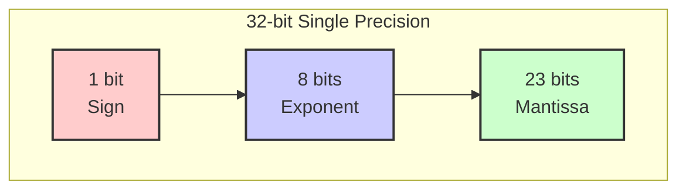
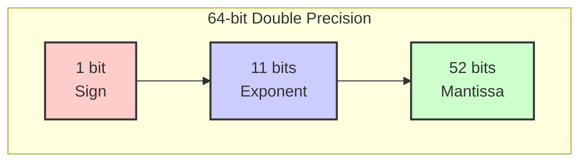
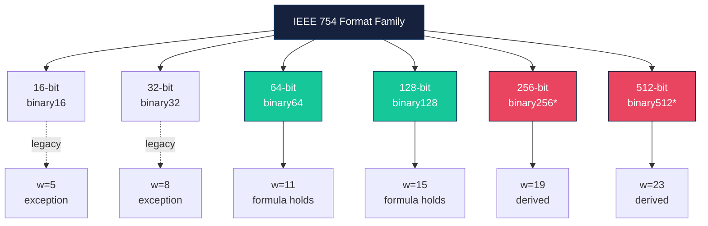

# Understanding IEEE 754: The Floating-Point Standard

> A beginner-friendly guide to how computers represent real numbers.  
> Author: Jiayao Hu
[English Version](<IEEE 754.md>) | [中文版本](<IEEE 754 Chinese Simplified.md>) 


## 1. Background and Definition

### 1.1 What is IEEE 754?

**IEEE 754** is the international technical standard for **floating-point arithmetic**. First published in **1985** and later revised in **2008** and **2019**, it defines:

- How real numbers are represented in binary 🔢
- How arithmetic operations should behave ➕➖✖️➗
- How to handle special cases like infinity and errors ⚠️

Before IEEE 754, every computer manufacturer used its own format. This meant the same program could produce **different results** on different machines. IEEE 754 fixed that by creating a universal language for decimal numbers in binary.

### 1.2 Why "Floating Point"?

Unlike **fixed-point** numbers (where the decimal point stays in one place), floating-point numbers allow the decimal point to "float" — shifting left or right using an **exponent**. This lets us represent both **very large** and **very small** numbers with the same format.

Think of it like scientific notation:

$$
6.022 \times 10^{23} \quad \leftarrow \text{the decimal point "floats" based on the exponent}
$$

---

## 2. The IEEE 754 Standard

### 2.1 The Basic Formats

IEEE 754 defines several formats. The most common are:

| Format | Total Bits | Exponent Bits | Mantissa Bits | Precision | Bias |
|--------|-----------|---------------|------------------|-----------|------|
| **binary16** (Half) | 16 | 5 | 10 | ~3.3 digits | 15 |
| **binary32** (Single) | 32 | 8 | 23 | ~7.2 digits | 127 |
| **binary64** (Double) | 64 | 11 | 52 | ~15.9 digits | 1023 |
| **binary128** (Quad) | 128 | 15 | 112 | ~34.0 digits | 16383 |

> 💡 **binary64** (Double Precision) is the default in most modern languages like Python, JavaScript, and C++ `double`.

### 2.2 Anatomy of a Floating-Point Number

Every IEEE 754 number is divided into three parts:

```
┌─────────┬──────────────────┬────────────────────────────────────────────┐
│  Sign   │    Exponent      │                  Mantissa                  │
│ (1 bit) │    (w bits)      │                  (t bits)                  │
└─────────┴──────────────────┴────────────────────────────────────────────┘
```

| Part | Role | Emoji |
|------|------|-------|
| **Sign** | `0` = positive, `1` = negative | ➕➖ |
| **Exponent** | Stores the power of 2 (with a bias) | 📏 |
| **Mantissa** (Significand) | Stores the precision digits | 🎯 |

The actual value is computed as:

$$
\text{Value} = (-1)^{\text{sign}} \times {(1.\text{mantissa})}_2 \times 2^{\text{exponent} - \text{bias}} 
$$

> 🔑 **Key insight:** Normal numbers always have an implicit leading `1` before the mantissa. This is called the **hidden bit** trick — you get one extra bit of precision for free!

### 2.3 Mermaid Diagram: Bit Layout (binary32 and binary64)





### 2.4 Special Values

Not every bit pattern represents a normal number. The exponent field has reserved patterns:

| Exponent Field | Mantissa| Meaning | Example |
|----------------|-------------|---------|---------|
| All zeros (`000...`) | Zero | **±Zero** | `+0.0`, `−0.0` |
| All zeros (`000...`) | Non-zero | **Subnormal** | Very tiny numbers |
| All ones (`111...`) | Zero | **±Infinity** | `1.0 / 0.0` |
| All ones (`111...`) | Non-zero | **NaN** (Not a Number) | `0.0 / 0.0` |

> 🧠 **Subnormal numbers** drop the implicit leading `1` and use `0` instead. This prevents a huge gap between the smallest normal number and zero.

---

## 3. Examples: Decimal ⟷ IEEE 754

### 3.1 Example 1: Decimal → IEEE 754 binary32 (Exact Case)

Let's convert **9.625** to IEEE 754 single precision (binary32).

#### Step 1: Convert to b$$
$$9.625_{10} = 1001.101_2 = 1.001101_2 \times 2^3 \quad \leftarrow \text{normalized form}
$$

#### Step 2: Extract the pieces

| Component | Value |
|-----------|-------|
| Sign | `0` (positive) |
| Exponent | `3` |
| Mantissa | `001101` (the part after the leading 1) |

#### Step 3: Apply the bias

For binary32, bias = **127**.

$$
\text{Stored exponent} = 3 + 127 = 130 = 10000010₂
$$

#### Step 4: Pad the mantissa to 23 bits
$$
\text{Fraction: } \underbrace{001101}_{6 \text{ bits}} \; \underbrace{00000000000000000}_{17 \text{ zeros}}
$$
#### Step 5: Assemble
| Sign  | Exponent  | Mantissa |
|--|--|--|
|  `0`   |  `10000010`   | `00110100000000000000000` |


**Final 32-bit result:**


`
0100 0001 0001 1010 0000 0000 0000 0000
`

**Hex:** `0x411A0000` ✅

---

### 3.2 Example 2: Decimal → IEEE 754 binary32 (Repeating Case)

Now let's try **0.1** — a number that is **infinitely repeating** in binary.

#### Step 1: Convert to binary
$$
0.1_{10} = 0.0001100110011..._2 \; (\text{repeats forever!}) = (1.100110011...)_2 \times 2^{-4}
$$

#### Step 2: Round to 23 bits

Since we only have 23 fraction bits, we must **round** the infinite sequence:

```
True fraction:    10011001100110011001100 110011... (repeating)
Stored (23 bits): 10011001100110011001101
                              ↑
                        rounded up here
```

#### Step 3: Assemble

- Sign: `0`
- Exponent: `-4 + 127 = 123 = 01111011₂`
- Fraction: `10011001100110011001101`

**Result:** `0x3DCCCCCD`

> ⚠️ **Important:** `0.1` is **not stored exactly**. The actual stored value is approximately `0.100000001490116119384765625`. This is why `0.1 + 0.2 ≠ 0.3` in most programming languages!

---

### 3.3 Example 3: IEEE 754 binary32 → Decimal

Let's decode this binary32 number:

```
1100 0001 0110 1100 0000 0000 0000 0000
```

#### Step 1: Split into fields

```
Sign:     1
Exponent: 10000010₂ = 130
Fraction: 01101100000000000000000
```

#### Step 2: Calculate the exponent

$$
\text{Actual exponent} = 130 - 127 = 3
$$

#### Step 3: Reconstruct the mantissa
$$
1.011011_2 = 1\times2^{0} + 0\times2^{-1} + 1\times2^{-2} + 1\times2^{-3} + 0\times2^{-4} + 1\times2^{-5} + 1\times2^{-6}
          = 1 + 0.25 + 0.125 + 0.03125 + 0.015625
          = 1.421875
$$


#### Step 4: Compute the value

$$
\text{Value} = (-1)^1 \times 2^3 \times 1.421875
          = -1 \times 8 \times 1.421875
          = -11.375
$$

**Answer: −11.375** ✅

---

## 4. Bit Allocation Derivation Formula 🔬

For formats **larger than 64 bits**, IEEE 754-2008 provides a formula to derive the bit allocation. This is how we can define **binary256**, **binary512**, or even larger hypothetical formats.

### 4.1 The Formula

For a *k*-bit binary interchange format (where *k* ≥ 64 and *k* is a multiple of 32):

| Field | Formula |
|-------|---------|
| **Exponent width** `w` | $$w = \text{round} (4\log_2 (k))  - 13$$  |
| **Trailing mantissa width** `t` | $$t=k-1-w$$ |
| **Precision** `p` | $$p = t + 1 = k − w$$ |
| **Bias** | $$2^{(w−1)} − 1$$ |

### 4.2 Why This Formula?

The design follows two principles:

1. 📈 **Precision grows linearly** with format size (~50% of bits go to the mantissa)
2. 📏 **Exponent range grows logarithmically** — only ~4 bits are added each time the format doubles in size

This ensures that as you use more bits, you get **more precision** (good for accuracy) rather than just **more range** (which is rarely needed).

### 4.3 Derivation Table

| Format | Total Bits `k` | $$w = \text{round} (4\log_2 (k))  - 13$$ | Exponent `w` | Mantissa `t` | Precision `p` | Bias |
|--------|---------------|----------------------------|-------------|----------------|--------------|------|
| binary16 | 16 | `round(16) − 13 = 3` | **5** ⚠️* | 10 | 11 | 15 |
| binary32 | 32 | `round(20) − 13 = 7` | **8** ⚠️* | 23 | 24 | 127 |
| binary64 | 64 | `round(24) − 13 = 11` | **11** ✅ | 52 | 53 | 1023 |
| binary128 | 128 | `round(28) − 13 = 15` | **15** ✅ | 112 | 113 | 16383 |
| **binary256** | 256 | `round(32) − 13 = 19` | **19** | 236 | 237 | 262143 |
| **binary512** | 512 | `round(36) − 13 = 23` | **23** | 488 | 489 | 4194303 |
| **binary1024** | 1024 | `round(40) − 13 = 27` | **27** | 996 | 997 | 67108863 |

> ⚠️ *binary16 and binary32 are **legacy exceptions**. They were defined before the formula was codified in 2008, so they have slightly wider exponents than the formula predicts. From binary64 onward, the formula is exact.*

### 4.4 Mermaid Diagram: Format Family Tree



> *binary256 and binary512 are not "basic formats" in the standard, but the formula is the official rule for extending the family.*

---

## 5. Common Pitfalls 🕳️

### 5.1 The Famous `0.1 + 0.2 ≠ 0.3`

Because `0.1` and `0.2` are infinitely repeating in binary, their stored representations are approximations:

```python
>>> 0.1 + 0.2
0.30000000000000004
```

This is **not a bug** — it is a fundamental property of binary floating-point. The solution? Use rounding when displaying, or use decimal arithmetic for financial calculations 💰.

### 5.2 NaN is Not Equal to Itself

```python
>>> import math
>>> nan = float('nan')
>>> nan == nan
False
```

This is by design! NaN represents an **invalid result**, so comparisons with it are always false.

### 5.3 Two Zeros

IEEE 754 has both `+0.0` and `−0.0`. They compare as equal, but can behave differently in division:

```python
>>> 1.0 / 0.0
inf
>>> 1.0 / -0.0
-inf
```

---

## 6. Summary 📝

| Concept | Key Point |
|---------|-----------|
| **Purpose** | Universal standard for representing real numbers in binary |
| **Structure** | 1 sign bit + `w` exponent bits + `t` mantissa bits |
| **Hidden bit** | Normal numbers get a free `1.` prefix for extra precision |
| **Bias** | Exponents are stored with a bias to avoid a sign bit |
| **Specials** | Zero, Subnormal, Infinity, and NaN handle edge cases |
| **Formula** | For *k* ≥ 64: $$w = \text{round} (4\log_2 (k))  - 13$$ |
| **Golden rule** | Most decimal fractions cannot be represented exactly! |

---

> 📌 **References**
> - IEEE Standard for Floating-Point Arithmetic (IEEE 754-2019)
> - IEEE Standard 754-2008
> - "What Every Computer Scientist Should Know About Floating-Point Arithmetic" — David Goldberg

---

> *If you like this guide, please give it a star 🌟. Your feedback is of great importance to me, as it facilitates me to perform better for future studies!*
